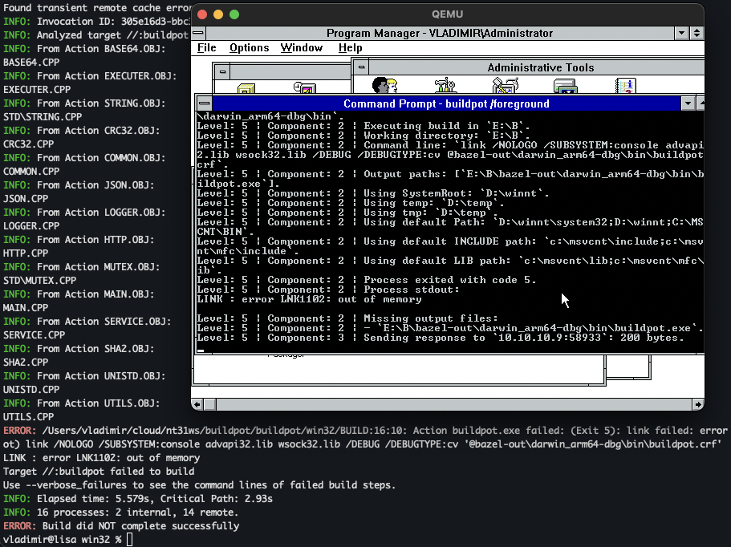

# Buildpot

Teapot which can build. Buildpot is an implementation of [Bazel Remote Execution](https://bazel.build/remote/rbe) for Microsoft Windows NT 3.1.

Buildpot can be built using Visual C++ 1.0 (for NT).

## Known issues

- Processes do not run from Windows service;
- Linker refuses to work — `LINK : error LNK1102: out of memory`.
